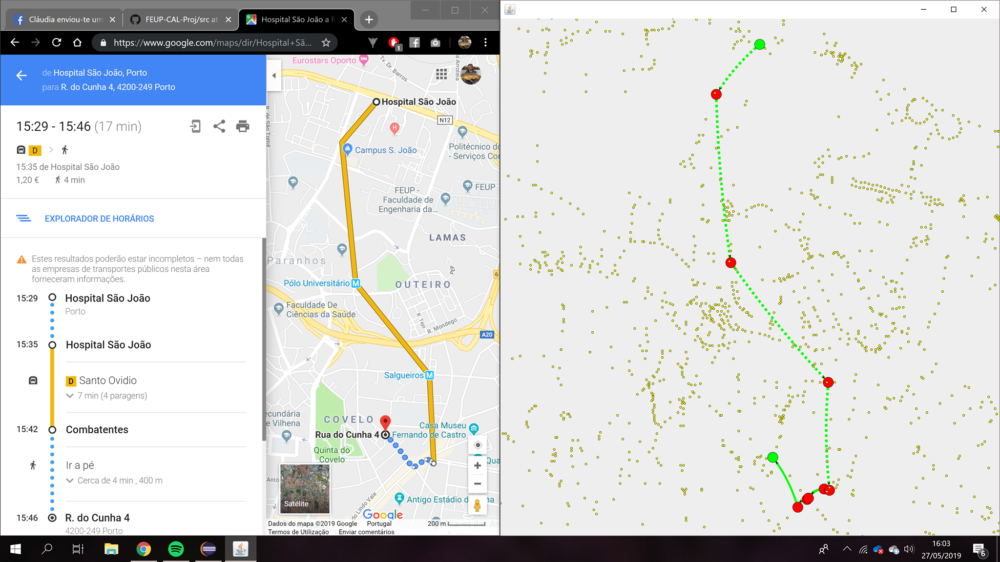

# FEUP-CAL-PROJ
  This project was developed for the CAL curricular unit.
   
**Nota da Primeira Entrega: 18.25.**  
**Nota da Segunda Entrega: 18.**

## Project Infos
* Date: 2nd Year, 2st Semester, 2018/2019
* Course: Concepção e Análise de Algoritmos (CAL) | Conception and Analysis of Algorithms
* Course Link: https://sigarra.up.pt/feup/pt/ucurr_geral.ficha_uc_view?pv_ocorrencia_id=419999

### Tema

#### TripMate: planeador de viagens multimodais 
   No dia-a-dia de um utilizador de transportes públicos, pode haver a necessidade de realizar várias viagens a depender das atividades planeadas para um dia, iniciando e terminando geralmente na morada de residência. Por exemplo, um estudante realiza geralmente a viagem casa-escola-casa, que poderá ser ainda combinada com a necessidade de deslocações para localidades onde o estudante realiza atividades  extracurriculares, como desporto. Já no caso de um trabalhador, poderão haver deslocações em intervalos do trabalho com objetivos diversos, como a necessidade de uma compra, ou alguma atividade de curta duração, ou mesmo uma reunião de trabalho com cliente. As várias atividades, com as respetivas restrições temporais (instante de início e tempo estimado de duração) compõem a agenda de um indivíduo para um dia.   
   
   Neste trabalho, pretende-se implementar uma aplicação que, dada a agenda de atividades de um indivíduo, sugira o plano de viagens na rede de transportes públicos, que poderá conter percursos de autocarro e metro, assim como trechos de caminhada a pé, entre paragens. O plano de viagem deverá ter em consideração os tempos estimados de deslocação total, com o objetivo de atender as restrições temporais das atividades, nomeadamente o seu instante de início e tempo estimado de duração. Sempre que uma nova atividade for adicionada à agenda de um dia, o itinerário deverá ser recalculado. 

### Exemplo de Output

    
### Team Members
Ana Filipa Campos Senra
* Student Number: 201704077
* E-Mail: up201704077@fe.up.pt

David Freitas Dinis
* Student Number: 201706766
* E-Mail: up201706766@fe.up.pt

## Disclaimer
This repository corresponds to school projects from the respective COURSE. The code on this repo is intended for educational purposes. I do not take any responsibility, liability or whateverity over any code faults, inconsistency or anything else. If you intend on copying most or parts of the code for your school projects, keep in mind that this repo is public, and that your professor might search the web for similar project solutions or whatnot and choose to fail you for copying.

(Credits to Rui Alves (xRuiAlves , https://github.com/xRuiAlves/) for the README layout) -->Take a look at his GitHub (it helped me a lot!)

